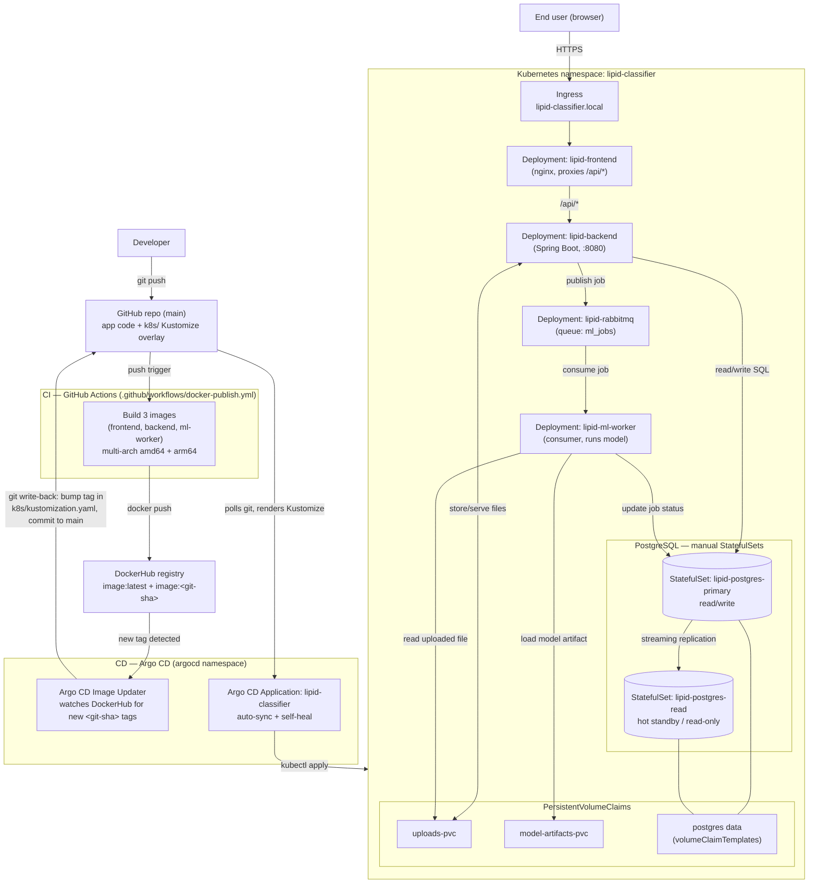

# Architecture: CI/CD + Kubernetes + Argo CD

This document describes the full architecture of the Lipid Class Classifier as
deployed on Kubernetes with a GitOps continuous-delivery pipeline. It covers
three flows:

1. **CI/CD flow** — how a `git push` becomes a running version in the cluster.
2. **Runtime request flow** — how a user request travels through the app.
3. **Database replication flow** — how the manual PostgreSQL primary/replica works.

## Diagram



## 1. CI/CD flow (push → deployed)

1. **Developer pushes to `main`** on GitHub.
2. **GitHub Actions** ([.github/workflows/docker-publish.yml](../.github/workflows/docker-publish.yml))
   triggers on the push, builds the three service images (frontend, backend,
   ml-worker) for `linux/amd64` + `linux/arm64`, and pushes them to **DockerHub**
   tagged with both `:latest` and the immutable `:<git-sha>`.
3. **Argo CD Image Updater** (in the `argocd` namespace) polls DockerHub, detects
   the newest `<git-sha>`-tagged build for each image, and **writes the new tag
   back into [k8s/kustomization.yaml](../k8s/kustomization.yaml)**, committing that
   change to `main` (git write-back method).
4. **Argo CD** continuously watches the Git repo. When it sees the new commit it
   renders the `k8s/` Kustomize overlay and applies it to the cluster
   (`auto-sync` + `self-heal`), so the running pods are updated to the exact
   published version. Git is the single source of truth; rollback is a `git revert`.

> Without Image Updater, steps 3–4 still work — you just bump the image tag in
> `kustomization.yaml` yourself and push; Argo CD does the rest.

## 2. Runtime request flow

1. A user hits **`http://lipid-classifier.local`**, which resolves to the
   **Ingress** ([k8s/ingress.yaml](../k8s/ingress.yaml)).
2. The Ingress routes to the **frontend** (nginx) Service. The frontend serves
   the SPA and **proxies `/api/*`** to the **backend** Service (`backend:8080`).
3. The **backend** (Spring Boot) handles auth and uploads. It:
   - reads/writes application data on the **PostgreSQL primary**
     (`lipid-postgres-primary:5432`, database `app_db`, user `user`),
   - stores the uploaded `.mzML` file on the shared **uploads PVC**, and
   - **publishes a job** to the `ml_jobs` queue on **RabbitMQ**.
4. The **ml-worker** consumes the job from RabbitMQ, **reads the uploaded file**
   from the uploads PVC, **loads the trained model** from the model-artifacts PVC,
   runs the prediction, and **writes the result/status** back to the PostgreSQL
   primary.
5. The frontend polls the backend for job status; when the job reaches `DONE`,
   the predicted class and probability are shown.

## 3. Database replication flow (manual StatefulSets)

PostgreSQL is **not** a Helm chart — it is hand-written in
[k8s/postgres-deployment.yaml](../k8s/postgres-deployment.yaml) using physical
streaming replication:

- **`lipid-postgres-primary`** (StatefulSet, 1 replica) is the read/write node.
  On first init it runs a script that creates a `replicator` role and opens
  `pg_hba.conf` for replication connections. Exposed via the
  `lipid-postgres-primary` Service (used by the app for all writes).
- **`lipid-postgres-read`** (StatefulSet) is a hot standby. Its init container
  runs `pg_basebackup -R` against the primary, then the node boots in standby
  mode and streams WAL from the primary. Exposed via the `lipid-postgres-read`
  Service for read-only traffic.
- Each node has its **own PersistentVolume** via `volumeClaimTemplates`.
- Credentials (app password + replication password) live in a manually managed
  **Secret** (`lipid-postgres-secret`); non-secret bootstrap logic lives in a
  **ConfigMap** (`lipid-postgres-scripts`).

Verify replication is live:

```bash
kubectl exec -n lipid-classifier lipid-postgres-primary-0 -- \
  psql -U user -d app_db -c "SELECT client_addr, state, sync_state FROM pg_stat_replication;"
# one row in state "streaming" = replica connected
```

## Namespacing & ownership

- All application resources live in the **`lipid-classifier`** namespace.
- Argo CD and Image Updater live in the **`argocd`** namespace.
- Once Argo CD manages the app, **Git is the source of truth** — change files
  under `k8s/` and push; do not `kubectl apply`/edit live resources by hand, or
  Argo CD's self-heal will revert the drift.
