# Kubernetes Architecture

End-to-end view of every Kubernetes object deployed for the Lipid Class
Classifier, all inside the `lipid-classifier` namespace.

## Objects at a glance

| Kind                | Name(s)                                                                                                                                                                                       | Notes                                                                 |
| ------------------- | --------------------------------------------------------------------------------------------------------------------------------------------------------------------------------------------- | --------------------------------------------------------------------- |
| Namespace           | `lipid-classifier`                                                                                                                                                                            | Isolation scope for the whole app                                     |
| Ingress             | `lipid-classifier`                                                                                                                                                                            | Host `lipid-classifier.local`, `proxy-body-size: 100m`, class `nginx` |
| Deployment          | `lipid-frontend`, `lipid-backend`, `lipid-ml-worker`, `lipid-rabbitmq`                                                                                                                        | Stateless / single-replica workloads                                  |
| StatefulSet         | `lipid-postgres-primary`, `lipid-postgres-read`                                                                                                                                               | One per DB role (read/write primary + hot-standby replica)            |
| Service (ClusterIP) | `lipid-frontend`, `backend`, `lipid-rabbitmq`, `lipid-postgres-primary`, `lipid-postgres-read`                                                                                                | Stable virtual IPs / load balancing                                   |
| Service (headless)  | `lipid-postgres-primary-headless`, `lipid-postgres-read-headless`                                                                                                                             | `clusterIP: None` → stable per-pod DNS for the StatefulSets           |
| ConfigMap           | `lipid-backend-config`, `lipid-ml-worker-config`, `lipid-postgres-scripts`                                                                                                                    | Non-secret config + Postgres bootstrap scripts                        |
| Secret              | `lipid-backend-secret`, `lipid-ml-worker-secret`, `lipid-rabbitmq-secret`, `lipid-postgres-secret`                                                                                            | Credentials, injected via `envFrom` / `secretKeyRef`                  |
| PVC                 | `lipid-uploads-pvc` (RWO 5Gi, shared), `lipid-model-artifacts-pvc` (RWO 2Gi, RO), `lipid-rabbitmq-pvc` (RWO 2Gi), plus per-pod `volumeClaimTemplates` for each Postgres StatefulSet (RWO 1Gi) | Persistent storage                                                    |
| initContainer       | `bootstrap-standby` (in `lipid-postgres-read`)                                                                                                                                                | Clones the primary with `pg_basebackup` before the standby starts     |

## Request and data flow

1. Browser hits `http://lipid-classifier.local` → **NGINX Ingress Controller** matches the host rule and routes to the `lipid-frontend` Service.
2. The frontend pod's **Nginx** serves the static React build and reverse-proxies `/api/*` to the `backend` Service (same-origin, no CORS).
3. The **backend** writes the uploaded `.mzML` to the shared `lipid-uploads-pvc`, creates a job row in PostgreSQL (`lipid-postgres-primary`), and publishes a message to RabbitMQ (`ml_jobs`).
4. The **ML worker** (no Service — it only consumes) reads the job from RabbitMQ, reads the file from the uploads PVC and the model from `lipid-model-artifacts-pvc`, runs inference, and writes the result back to PostgreSQL.
5. The frontend polls the backend for job status until `DONE`.

## PostgreSQL replication

- `lipid-postgres-primary` — read/write primary, started with replication flags (`wal_level=replica`, `max_wal_senders`, `hot_standby`).
- `lipid-postgres-read` — read-only hot standby. Its `bootstrap-standby` initContainer clones the primary via `pg_basebackup` and then streams the WAL.
- Each role has a **headless Service** (stable per-pod DNS, required by the StatefulSet) plus a normal **ClusterIP Service** that apps connect to.
